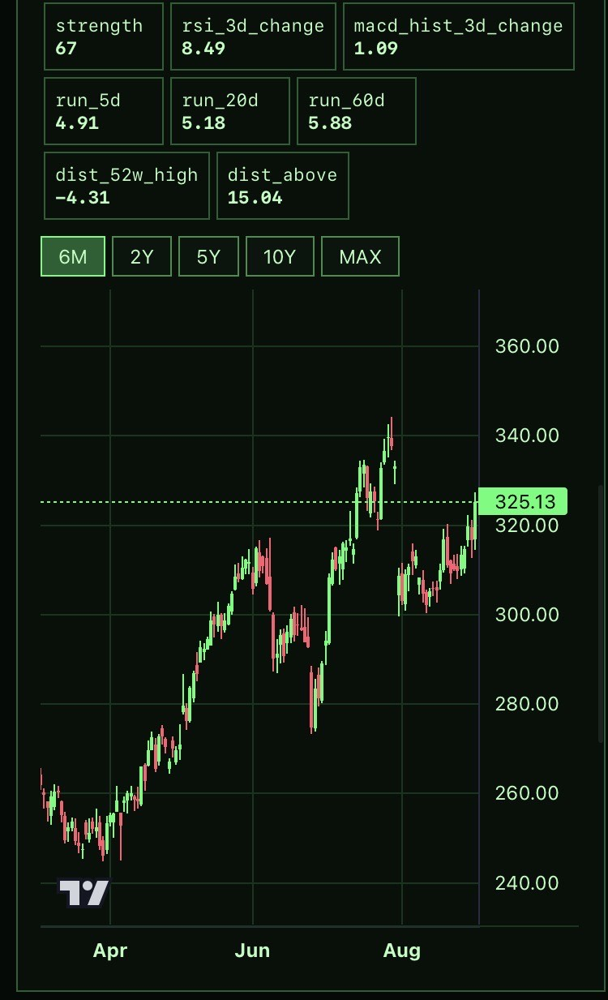

# Trade Sentinel MVP

A self-hosted, paper-only stock research dashboard. Market data is switched globally with **one environment variable**; all providers normalize historical daily OHLCV data into the same local SQLite cache, so charts, signals, autocomplete, and screening use the selected backend consistently.



## Choose a provider

```dotenv
# Default: free/best-effort US + international coverage, including Yahoo symbols such as IFX.DE and OMV.VI
MARKET_DATA_PROVIDER=yfinance

# Alternative: requires an API key; Basic coverage is mainly US equities/ETFs, forex and crypto
# MARKET_DATA_PROVIDER=twelvedata
# TWELVE_DATA_API_KEY=your_key
```

`yfinance` uses Yahoo Finance's public endpoints through the `yfinance` library. It enables global ticker search and mixed US/EU screeners without a data key, but it is not an official market-data API: cache aggressively, throttle manual screener runs, and treat it as EOD/best-effort research data. Do not use it for execution.

## Run

```bash
cp .env.example .env
nano .env
docker compose up -d --build
```

Open `http://SERVER:8010`. Altering `MARKET_DATA_PROVIDER` requires a restart: `docker compose up -d --build`.

## Local development

```bash
cp .env.example .env
python generate_icon.py        # build static/icon-180.png (PWA icon)
uv sync                        # install dependencies
uv run uvicorn app.main:app --reload --port 8000
```

The icon is a build artifact (gitignored); regenerate it after cloning.

## CDN scripts and Subresource Integrity (SRI)

The frontend loads two libraries from jsdelivr (lightweight-charts and marked). Each `<script>` tag in `static/index.html` carries an `integrity="sha384-..."` attribute — a Subresource Integrity hash. The browser refuses to execute the file if the hash doesn't match, so a compromised CDN or tampered network can't inject malicious JS.

**When bumping a CDN version** you must recompute the hash, otherwise the browser silently blocks the script:

```bash
curl -s https://cdn.jsdelivr.net/npm/marked@<NEW_VERSION>/marked.min.js \
  | openssl dgst -sha384 -binary | openssl base64 -A
```

Paste the output into the `integrity="sha384-<hash>"` attribute on the corresponding `<script>` tag. Do the same for `lightweight-charts`.

## Autocomplete and screener

Autocomplete uses the selected provider. With `yfinance`, it supports fuzzy company/ticker lookup and returns canonical Yahoo symbols such as `IFX.DE`, `ASML.AS`, and `OMV.VI`. The `global-large-cap` universe mixes US, German, Dutch, French, Swiss, and Vienna listings. Press **Update** manually after markets close; it downloads and caches about two years of daily candles for each symbol, then ranks trend alignment, 20/60-day momentum, RSI, and relative volume.

No live broker or order API exists. Signals and rankings are research tools, not financial advice.

## AI / space universe

`universes/global-large-cap.txt` is now an AI and advanced-technology research universe. It includes semiconductors, AI infrastructure/platforms, application/automation names, space/connectivity companies, selected European listings, and recent IPOs such as CoreWeave (`CRWV`), Figma (`FIG`), Circle (`CRCL`), Chime (`CHYM`) and eToro (`ETOR`). SpaceX is listed as `SPCX`; use provider autocomplete to confirm current symbol availability before a screen run. A company being included only makes it a candidate for a rule-based research screen, not an investment recommendation.

## Fix: duplicate screener symbols

The screener deduplicates a universe while preserving its order before downloading data and saving results. This prevents duplicate entries such as a symbol classified in both AI and space groups from violating SQLite's `(universe, ticker)` uniqueness constraint.

## Walk-forward optimization / backtest tool

`app/optimize.py` is a **separate, read-only** analysis tool that replays the deterministic strategy against stored historical candles and reports how well a given parameter set would have performed. It never touches the live sim account, positions, or trades.

The DB lives in the Docker volume, so run it inside the container (use the venv python):

```bash
# Score the current rules on stored history
docker compose exec trade-sentinel /app/.venv/bin/python -m app.optimize backtest --end 2026-08-11

# Grid-search the thresholds (buy/sell/relaxed-hold strength)
docker compose exec trade-sentinel /app/.venv/bin/python -m app.optimize sweep --start 2025-01-01 --end 2026-08-11

# Walk-forward: fit best params on each train window, score on the following test window
docker compose exec trade-sentinel /app/.venv/bin/python -m app.optimize walkforward --train-days 504 --test-days 126 --start 2024-01-01 --end 2026-08-11
```

Common flags: `--start`/`--end` (YYYY-MM-DD, inclusive) bound the window; `backtest --trades` prints every trade. The walk-forward spans the full candle history by default, which can be slow — bound it with `--start`/`--end` to recent, data-dense history.

**How it works:** indicator series are precomputed once per ticker (vectorized, mirroring `analysis.compute`), then the replay runs the deterministic SELL/ATR-stop/BUY/relaxed-HOLD logic over a paper portfolio with monthly allowance deposits, producing an equity curve, return, Sharpe, and max drawdown. The sweep varies `buy_threshold`, `sell_threshold`, and `relaxed_hold_strength`; walk-forward fits on each train window and reports out-of-sample test results to detect overfitting/regime change.

**Caveats:** this is a no-fees, no-slippage, fractional-share paper backtest — treat absolute returns/drawdowns skeptically. The walk-forward *relative* comparison across windows is the more meaningful signal.

### LLM benchmark (`llm-benchmark`)

Probes whether the configured LLM would have turned the deterministic model's worst decisions. It replays the deterministic strategy over stored history, scores every trade by its 20-trading-day forward outcome (a BUY is bad when the price then fell; a SELL/stop-out is bad when the price then rallied), picks the 8 worst mistakes plus 2 control cases where the model was clearly right, reconstructs the exact indicator snapshot and portfolio state at each decision point, and sends each to the LLM using the *same* hybrid-sim system prompt and JSON format — then reports whether the LLM agreed, turned to HOLD, or flipped the call.

```bash
# Preview which cases would be probed (no LLM call, no tokens)
docker compose exec trade-sentinel /app/.venv/bin/python -m app.optimize llm-benchmark --start 2024-01-01 --end 2026-07-15 --skip-llm

# Run the probe (~10 LLM calls — one per selected case)
docker compose exec trade-sentinel /app/.venv/bin/python -m app.optimize llm-benchmark --start 2024-01-01 --end 2026-07-15
```

`--end` defaults to `2026-08-11` (leaving a 20-day forward buffer to judge the last trades). Tune `--n-worst`, `--n-control`, and `--forward-days` to control token spend. Raw LLM reasoning for each case is dumped to `/tmp/llm_benchmark_reasoning.json` for inspection. The benchmark is read-only and never touches the live sim account.

## LLM backends (model switching)

The dashboard's AI chat, the sim bot's LLM reasoning, and the LLM benchmark all talk to whichever backend is active. You can switch models at runtime from the **dropdown in the top-right of the dashboard** — no restart needed, and the choice persists in the `/data` volume.

```dotenv
# JSON list of backends (single line — dotenv can't parse multi-line values):
LLM_BACKENDS=[{"name":"llama-server","type":"openai","url":"http://your-server-ip:8084","model":"Qwen3.8-27B-IQ4_XS.gguf"},{"name":"ollama","type":"ollama","url":"http://host.docker.internal:11434","model":"qwen3:32b"}]
```

- `type: "openai"` — OpenAI-compatible `/v1/chat/completions`; works with llama.cpp **llama-server**, vLLM, LiteLLM, etc.
- `type: "ollama"` — Ollama's native `/api/chat`.
- The dropdown lists every model each backend reports; selecting one switches backend + model on the spot.
- Without `LLM_BACKENDS`, the legacy `OLLAMA_URL` / `OLLAMA_MODEL` pair is used as a single backend.

## Timezone convention

All `created_at` / `updated_at` timestamps are stored as tz-aware UTC in SQLite. The autonomous paper-trading scheduler runs at `SIM_RUN_HOUR`:`SIM_RUN_MINUTE` **UTC** (set `22 30` to run at 22:30 UTC). The monthly allowance deposits for BOTH paper portfolios (sim + monthly qv-mom) are anchored to the operator's local timezone (`ALLOWANCE_TZ`, `Europe/Vienna` by default) so the deposits land on the local calendar month boundary — and at the *start* of the month, so the two portfolios' cumulative "contributed" figures step in lockstep and their equity curves are directly comparable. The monthly qv-mom portfolio additionally takes a daily equity snapshot (right before the main nightly cycle), so its curve moves every day instead of only at month-end rebalances. The frontend displays the sim chart axis labels and trade log times in the operator's local timezone (`Europe/Vienna`), converting the stored UTC ISO strings on the client.
